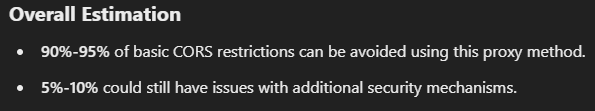

## Bypass CORS restrictions with ease!

Don't like those CORS errors? Well I have the thing for you!

Just a simple Script with a few lines of _actual_ Code, to bypass 90-95% of the CORS Restrictions. Don't believe me? ChatGPT gave that estimations, not me!
</br>
</br>


### Base URL:

```
https://bypass-cors.vercel.app/
```

### Usage:

**For GET Requests only, use below technic:**

```node js
fetch("https://bypass-cors.vercel.app/?url=https://your-target-cors-url.com");
```

**For Requests of Any Method, use below technic:**

```node js
fetch("https://bypass-cors.vercel.app", {
    method: "POST",
    headers: {
        "content-type": "application/json",
    },
    body: JSON.stringify({
        url: "https://your-target-cors-url.com",
        options: {
            method: "GET | POST | PUT | DELETE",
            headers: {
                "content-type": "application/json",
            },
            body: JSON.stringify({ data: "some-important-data" }),
        },
    }),
});
```

### Simplified:

For any method except GET, just think of the body of the request as your `fetch` function's parameters!

-   `url` : for url
-   `options` : for options you give in fetch!
